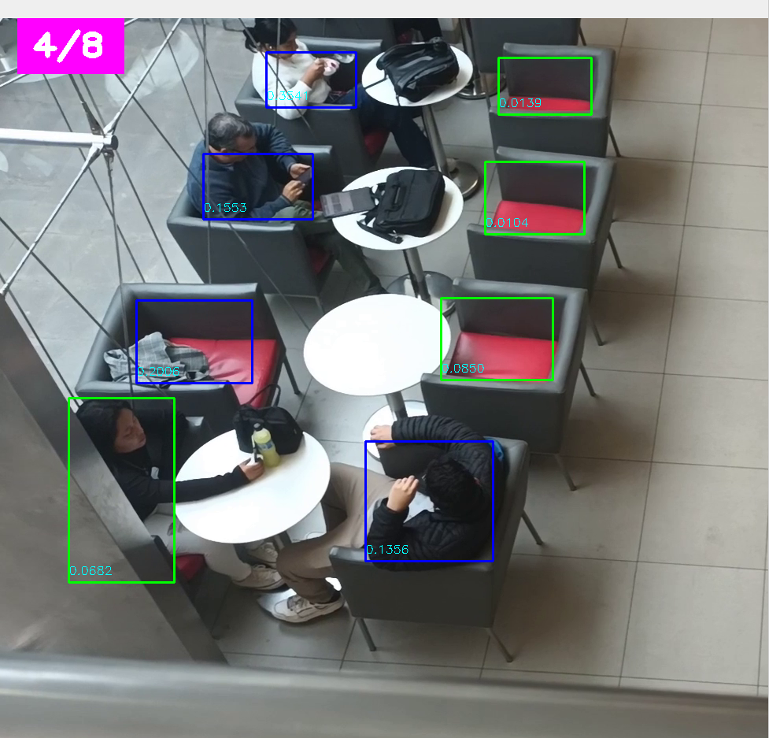

# Free Zones detector 
### estudiantes 

| nombre                   | codigo     |
|--------------------------|------------|
| Cesar Torres Paniagua    | u201615124 |
| Joseph Ramirez Sarmiento | u20211c828 |
| Alejandro  López Flores  | u201922773 |

## Pasos para Compilacion


instalar depencias con conda
````pycon
conda create --name <environment_name> --file requirements.txt
````
instalar dependencias con pip
````pycon
python -m venv env
.\env\Scripts\activate.bat
pip install -r requirements.txt
````

1.descargar video 
````pycon
gdown 1cpZBv1CPcyDbC4Y1KukvVYoFgKHU5LZT
````
2. compilar get_zones.py
3. compilar main.py

## Resultados

